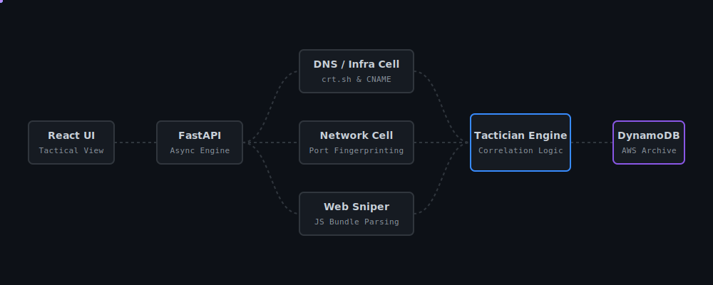
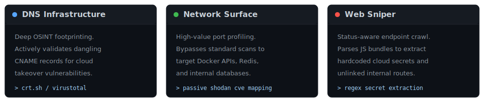

<div align="center">


<br><br>


<br><br>

&nbsp;<a href="#"></a>&nbsp;<a href="#"></a>&nbsp;<a href="#"></a>

**Unify your OSINT. Correlate your vectors. Archive your intelligence.** <br>
<sub>*A purely deterministic, rule-based orchestrator.*</sub>

</div>

<div align="center">
<a href="#diagram-deploy"></a>
</div>

## Quick Start — Local Environment Setup

*Cloud-Sentry requires specific OS-level dependencies to prevent Python network and cryptography build failures.*

**Requirements**: Python 3.10+, Node.js, Nmap.

### 1. OS-Specific Prerequisites

<details>
<summary><b>Windows Setup</b> (Click to expand)</summary>

Install Nmap and manually add the Nmap installation folder (e.g., `C:\Program Files (x86)\Nmap`) to your System Environment Variables (PATH). 
*(Note: If PowerShell virtual environment activation fails, run PowerShell as Administrator: `Set-ExecutionPolicy Unrestricted -Force`)*.
</details>

<details>
<summary><b>Linux (Debian/Ubuntu) Setup</b> (Click to expand)</summary>

```bash
sudo apt update
sudo apt install nmap python3-venv python3-dev build-essential
```
</details>

<details>
<summary><b>macOS Setup</b> (Click to expand)</summary>

```bash
xcode-select --install
brew install nmap python node
```
</details>

<details>
<summary><b>Termux (Android/ARM) Setup</b> (Click to expand)</summary>

```bash
pkg update
pkg install rust clang make libffi openssl nmap python nodejs
```
*(Note: The pip install step will take 5-10 minutes to physically compile Rust binaries).*
</details>

### 2. Configure Infrastructure

Create a `.env` file in the `backend/` directory:

```dotenv
AWS_ACCESS_KEY_ID=your_access_key
AWS_SECRET_ACCESS_KEY=your_secret_key
AWS_REGION=us-east-1
DYNAMODB_TABLE_NAME=CloudSentry_Intel
USER_POOL_ID=your_cognito_pool_id
SHODAN_API_KEY=your_shodan_key
VIRUSTOTAL_API_KEY=your_vt_key
```

### 3. Launch the Backend Engine

```bash
git clone https://github.com/nayyarbil/Cloud-Sentry.git
cd Cloud-Sentry/backend
python -m venv venv
source venv/bin/activate  # Windows: venv\Scripts\activate
pip install -r requirements.txt
uvicorn main:app --reload
```

### 4. Launch the Tactical Interface

Open a new terminal window:

```bash
cd Cloud-Sentry/frontend
npm install
npm run dev
```

## Under the Hood

### 1. A Highly Concurrent Intelligence Ecosystem

Cloud-Sentry ships with three isolated, concurrent micro-cells for reconnaissance. The DNS Cell handles infrastructure OSINT via crt.sh and VirusTotal. The Network Cell bypasses standard scans to fingerprint high-value ports (Docker, Redis). The Web Sniper Cell crawls endpoints and parses JavaScript bundles for hardcoded cloud secrets. 

<p id="key-features" align="center">
  <a href="#key-features"></a>
</p>

### 2. The Tactician Engine (Deterministic Core)

There are no AI hallucinations or costly API token burns here. Cloud-Sentry relies on a purely deterministic correlation engine. It ingests the fragmented JSON data from the three intelligence cells and applies strict IF/THEN logic to map open ports against discovered web routes, generating actionable, prioritized attack vectors.

### 3. AWS Native Archiving

Security data is useless if it is lost when the terminal closes. Cloud-Sentry natively integrates with AWS Cloud infrastructure. Every threat vector and piece of raw intelligence is automatically sanitized, serialized, and pushed silently to an AWS DynamoDB table for permanent historical tracking and cross-target querying.

## Disclaimer

This framework is designed strictly for authorized penetration testing, bug bounty hunting on in-scope assets, and educational purposes. Ensure you have explicit permission before scanning any target.

